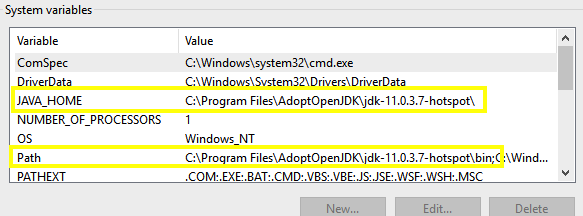

# OMERO R Gateway

R wrapper around the OMERO Java Gateway, to enable access to OMERO via R using [rJava](https://cran.r-project.org/web/packages/rJava/index.html).

## Prerequisites

### Users

* [R](https://www.r-project.org/)
* [Java](http://openjdk.java.net/)
* R package: [rJava](https://cran.r-project.org/web/packages/rJava/index.html)
* R package: [jpeg](https://cran.r-project.org/web/packages/jpeg/index.html)
* R package: [httr](https://cran.r-project.org/web/packages/httr/index.html)

### Developers

Need additionally:

* R package: [devtools](https://cran.r-project.org/web/packages/devtools/index.html)
* R package: [testthat](https://cran.r-project.org/web/packages/testthat/index.html) (optional)
* [Git](https://git-scm.com/)

## Install the romero.gateway R package

Download the latest romero.gateway version which is compatible with your OMERO server version from the [Release page](https://github.com/ome/rOMERO-gateway/releases)

OMERO version | romero.gateway version
--- | --- 
5.6 | 0.4.8
5.5 | 0.4.7
5.4 | <= 0.4.7

### Windows

Download the zip package.

In RStudio "Install Packages" use option "Install from:" "Package Archive File" and select the romero.gateway zip file.

Alternatively: In R console run `install.packages("https://github.com/ome/rOMERO-gateway/releases/download/vx.x.x/romero.gateway_x.x.x.zip", repos = NULL)`

See [Tips for Windows users](#tips-for-windows-users) section if you are running into difficulties.

### Unix / OSX

Download the tar.gz package.

In RStudio "Install Packages" use option "Install from:" "Package Archive File" and select the romero.gateway tar.gz file.

Alternatively: In R console run `install.packages("https://github.com/ome/rOMERO-gateway/releases/download/vx.x.x/romero.gateway_x.x.x.tar.gz", type='source', repos = NULL)`

See [Tips for Unix users](#tips-for-unix-users) section if you are running into difficulties.

### Docker / Jupyter

With [Docker](https://www.docker.com/) and [Jupyter](https://jupyter.org/) there is a quick and easy way to
get an R OMERO enviroment set up and running in your browser. Ideal to quickly try out some snippets. Go to
[jupyter](jupyter) directory and see the instructions there.

## Usage

* Like any other R package load the package ```library(romero.gateway)```
* Try some examples from the [examples directory](examples)
* Another potential source of examples is the unit tests directory: [tests/testthat](tests/testthat)

## Build from source

### install.R script

This allows you to install a custom version or build from a custom branch.

Use the [install.R](install.R) script:

```
  curl -o install.R https://raw.githubusercontent.com/ome/rOMERO-gateway/master/install.R 
  Rscript install.R
```

This will build and install the current master branch by default. But you can specify a particular branch or version to build or perform a local build of the cloned repository. Run `Rscript install.R --help` to see more details.

### Manually

* Clone this Github repository `git clone https://github.com/ome/rOMERO-gateway.git`
* Cd into the directory and start R console `cd rOMERO-gateway` `R`
* Load devtools library `library(devtools)`
* Build the package `devtools::build()`

## Unit tests

* Install [testthat](https://cran.r-project.org/web/packages/testthat/index.html)
* Spin up an OMERO server to test against
* Adjust and run [test-data](.omeroci/test-data) script to populate 
the test server
* Adjust [setup.csv](tests/testthat/setup.csv) to match your test server setup (mostly `omero.host` etc; the various ids should be ok if you used the `test-data` script
to populate the server)
* Run ```devtools::test()```


## Tips for Unix users

### Installing rJava

Before installing the `rJava` package you probably have to set up Java for R first:
```
# as root
export $JAVA_HOME=[path to JDK/JRE]
R CMD javareconf
```

### Additional dependencies

In order to build/install some necessary R packages, additional system libraries may
have to be installed first. E.g. the R packages `httr` and `xml2` need the development libraries for
`curl` and `xml2`, so for example on a Debian system you probably have to install `libcurl4-dev`
and `libxml2-dev` first.
If you can't install an R package due to compile errors, most likely you are missing a development 
package of some dependent library on your system.

## Tips for Windows users

### Installing rJava

You need to have a Java SDK installed. Latest version which is supported is 11.
Download for example the Adopt OpenJDK 11 from https://adoptopenjdk.net/ 

Make sure that the java executable is on your `Path` and `JAVA_HOME` is set,
see 'Environment Variables' settings:


Then install `rJava` as well as the additional dependencies for the R gateway
`httr` and `jpeg` from CRAN. Finally install the `romero-gateway` from the zip file.

